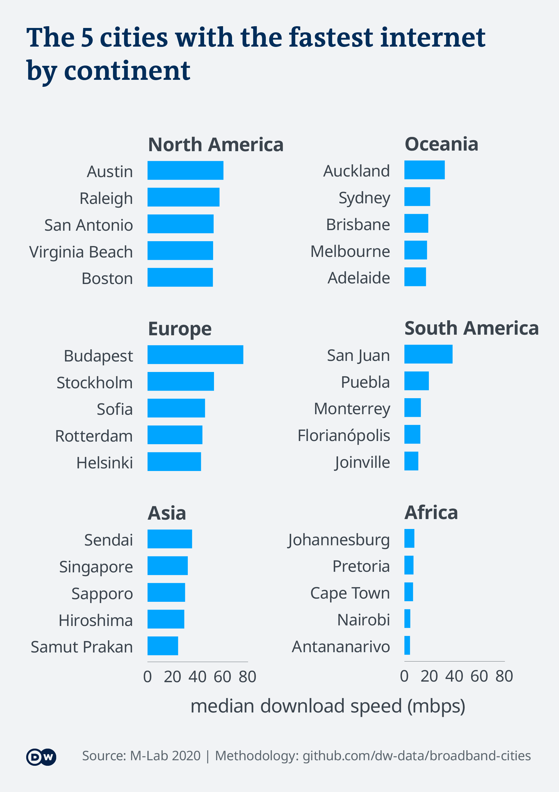
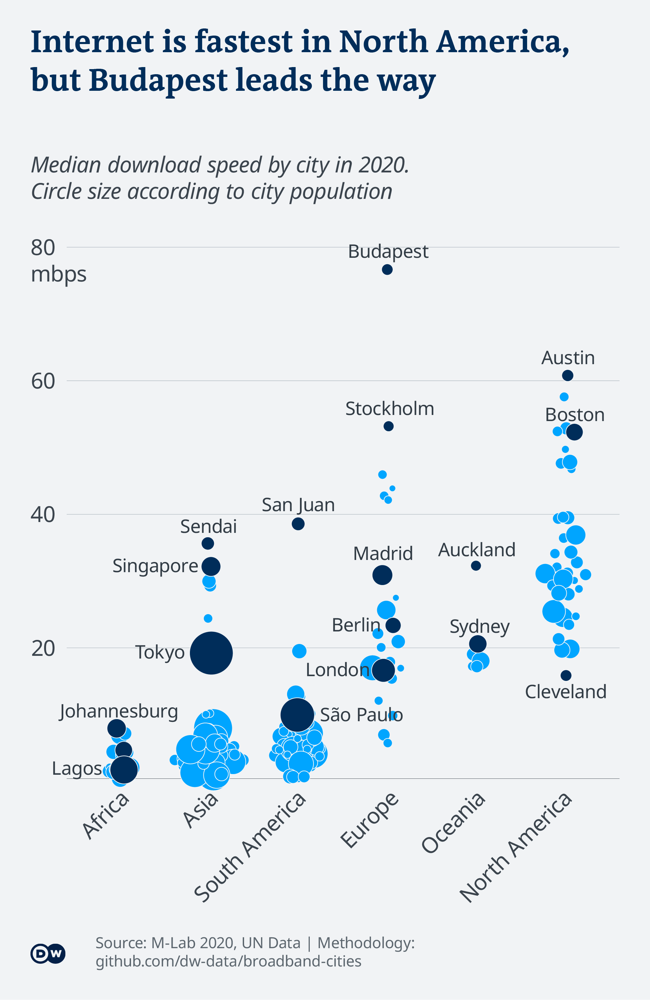

# Berlin, Lagos, Budapest: How fast is your internet?

Working from home is the new normal for millions of people worldwide.
Yet, data shows that 6 in 10 users do not have internet connections fast
enough for smooth telework. Has the pandemic deepened the digital
divide?

*In this repository, you will find the methodology, data and code behind
the story that came out of this analysis.*

**Read the full article on DW:** [English](https://p.dw.com/p/3jdPr) | [German](https://p.dw.com/p/3jgXC)

**Story by:** [Kira Schacht](https://www.twitter.com/daten_drang) and
[Peter Hille](https://twitter.com/peterhille)

# Files

| Name                   | Content                                                                           |
| ---------------------- | --------------------------------------------------------------------------------- |
| `broadband_cities.Rmd` | The main R markdown script. Run in RStudio to reproduce this analysis.            |
| `data.RData`           | The R Data file containing the imported datasets. Use if csv import doesn’t work. |
| `data/...`             | Data files                                                                        |

# Data sources

## Internet speed test data

This analysis uses data from [M-Lab](https://www.measurementlab.net/),
an open source project which collects and provides data on internet
speeds around the world. We use the results of their off-network
measurements (NDT tests). The data is crowdsources, updated continuously
and made freely available to the public. You can get more information
about their datasets as well as a guide on how to get started in working
with it yourself on their [website](https://www.measurementlab.net/data/).

  - For data on median values per city, we used their
    [Dashboard](https://datastudio.google.com/reporting/12XddYj7__cZOaBF2RwplImw_ZdQQ5Nuw/page/9GTNB)
  - For a list of all measurements from Budapest, Berlin and Lagos,
    which we examine more closely, we used their BigQuery SQL interface.
    See query
    [here](https://console.cloud.google.com/bigquery?sq=754187384106:940cba401ad44bbf89eec11745789388)
  - We also used BigQuery to calculate how many total measurements since
    2019 have registered a download speed of at least 25 mbps. You can
    see that query
    [here](https://console.cloud.google.com/bigquery?sq=754187384106:a47c12beb9064ec0afde591ed0991892)

## Geodata

  - UN Statistics Division: [Standard country or area codes for
    statistical use (M49)](https://unstats.un.org/unsd/methodology/m49/): country codes
    and corresponding regions and continents
  - UN Department of Economic and Social Affairs: [The World’s Cities
    in 2018 Data Booklet](https://www.un.org/en/events/citiesday/assets/pdf/the_worlds_cities_in_2018_data_booklet.pdf):
    population of cities with at least 1 million inhabitants

# Analysis

Here is a step-by-step-explanation of the code we used in this analysis.
You can explore it yourself by opening `broadband_cities.Rmd` in
RStudio.

## 0\. Read data

For median values per city: Only include cities with at least 2500 data
points.

``` r
#check if data is already there. if not, read it from html tables
if(file.exists("scripts/data.RData")){
  load("scripts/data.RData")
} else {

#read medium values by city
d = read.csv("data/processed/input/mlab-dashboard-cities-median-20201006.csv", stringsAsFactors = F) %>%
    select(country = Country, city = City,
           mbps = Median.Download, n = X..Download) %>% 
    filter(n >= 10000) %>% 
    mutate(country = gsub("Hashemite Kingdom of ","",country)   )

#read city populations for cities > 1mn people
geo = read.csv2("data/processed/geo/cities-population.csv", stringsAsFactors = F) %>% select(3,4,population = X2018) %>% 
  mutate(population = population*1000,
         Country.or.area =
           gsub(" \\(Plurinational State of\\)| \\(Bolivarian Republic of\\)|United Republic of | of America|n Federation","",Country.or.area) %>%
           gsub("Côte d’Ivoire","Ivory Coast",.) %>%
           gsub("Viet Nam","Vietnam",.) %>% 
           gsub("^Republic of Korea","South Korea",.) %>% 
           gsub("China, Hong Kong SAR","Hong Kong",.) %>% 
           gsub("China, Taiwan Province of China","Taiwan",.))
d = d %>% left_join(geo, by = c("city" = "City", "country" = "Country.or.area"))

#read country and continent codes
geo = read.csv2("data/processed/geo/country-and-continent-codes-list.csv", stringsAsFactors = F) %>% 
    mutate(country =
             gsub(" \\(.+$|China, | Special Administrative Region| of Great Britain and Northern Ireland| of America|n Federation|United Republic of ","",country) %>% 
             gsub("Côte d’Ivoire","Ivory Coast",.) %>%
             gsub("Viet Nam","Vietnam",.) %>% 
             gsub("^Republic of Korea","South Korea",.) %>% 
             gsub("Lithuania","Republic of Lithuania",.),
           continent = ifelse(continent != "Americas",continent,
                         ifelse(region == "Northern America", "North America","South America")))
d = d %>% left_join(geo, by = "country")
rm(geo)

d_cities = read.csv("data/processed/input/mlab-bq-results-cities-selection-20201006.csv")

save.image("scripts/data.Rdata")
}
```

List of datasets used:

  - `d` Median speeds for cities since 2020-01-01, extracted from the
    dashboard. Only cities with \>= 2500 data points included. Merged
    with continent and region information, as well as population data
    for cities with more than 1 million inhabitants in 2018
  - `d_cities` All data points since 2019-01-01 for Berlin, Budapest and
    Lagos


``` r
ggplot(d, aes(mbps, n)) + geom_point()
```

When cities have fewer than approx. 500,000 data points, download speeds vary more.

## 1\. Median speed in cities of the world

### 1.1 Extract: Manual selection of interesting cities

``` r
highlight.cities = c("Geneva","Budapest","Mechelen","New York","Tallinn","Taipei","Madrid","Los Angeles","Berlin","Tokyo","Sydney","Paris","Lisbon","Milan","Rome","São Paulo","Bangkok","Johannesburg","Delhi","Rio de Janeiro","Hyderabad","Seoul","Nairobi","Jakarta","Lagos")

d %>% filter(city %in% highlight.cities) %>%
  write.csv2("data/processed/output/cities-median-selection.csv", row.names = F,na="")
```

File: `cities-median-selection.csv`

## 1.2 Top and flop list per continent

Only including cities with a population of \>= 1mn.

``` r
x = d %>% filter(!is.na(population)) %>% select(continent, country, city, mbps) %>% 
  group_by(continent) %>%
  mutate(median.continent = median(mbps),
         rank = n()-min_rank(mbps)+1)

x %>% top_n(10, mbps) %>% arrange(continent, -mbps) %>% 
  write.csv2("data/processed/output/cities-median-top-10.csv",row.names = F)
x %>% top_n(-10, mbps) %>% arrange(continent, mbps) %>% 
  write.csv2("data/processed/output/cities-median-flop-10.csv",row.names = F)
```

File: `cities-median-top-10.csv`

File: `cities-median-flop-10.csv`

``` r
y = x %>% top_n(5, mbps) %>% arrange(continent, -mbps) %>%
  mutate(city = city %>% factor(levels = rev(.)),
         continent = continent %>% factor(levels = x %>% arrange(-median.continent) %>%
                                            `$`(continent) %>% unique))

plot = ggplot(y, aes(mbps, city)) + geom_bar(stat = "identity", fill = dw_info[1], width=.7) +
  facet_wrap(vars(continent), scales="free_y", ncol = 2) + 
  theme_minimal() + theme(panel.grid.major.y = element_blank()) +
  labs(title = "The top 5 cities with the fastest internet\non every continent",
       x = "median download speed (mbps)", y=NULL) + theme_dw() +
  theme(panel.grid.major.y = element_blank(), panel.spacing = unit(6, "lines"),
        axis.title.x = element_text(color = dw_grey[14], size = 65))
finalise_dwplot(plot,"Source: M-Lab", "graphics/preliminary/png/179_en_broadband_ranking.png", "png",
                width_pixels=1920, height_pixels= 2700)
finalise_dwplot(plot,"Source: M-Lab", "graphics/preliminary/179_en_broadband_ranking.svg", "svg",
                width_pixels=1920, height_pixels= 2700)
```



### 1.3 Speeds per continent by city and population

``` r
highlight.cities= c("Johannesburg","Nairobi","Lagos",
                    "Budapest","Stockholm","Berlin","Madrid","London",
                    "San Juan","São Paulo",
                    "Austin","Boston","Vancouver",
                    "Singapore","Tokyo","Sendai",
                    "Auckland","Sydney")
x = d %>% filter(!is.na(population)) %>%
  mutate(highlight = ifelse(city %in% highlight.cities, TRUE, FALSE),
         label = ifelse(city %in% highlight.cities, city, ""),
         continent = factor(continent) %>% factor(., levels = levels(.)[c(1,2,6,3,5,4)]))

plot = ggplot(x, aes(x=continent, y = mbps, fill = highlight, label = label)) +
  geom_quasirandom(aes(size = population/10^6), shape = 21,
                   colour = dw_grey[1], varwidth = TRUE) +
  geom_text(hjust = 0, position = position_quasirandom(varwidth = TRUE), colour = dw_grey[14]) +
  scale_fill_manual(values = dw_info[1:2] %>% unname) +
  scale_y_continuous(expand = expansion(mult = c(0,.05))) +
  theme_minimal() + guides(fill=F,size=F) +
  theme(panel.grid.major.x = element_blank()) +
  labs(title = "Internet is fastest in North America,\nbut Budapest trumps all",
       x = NULL, y = "median download speed (mbps)", size = "population (mn)") +
  scale_size_continuous(range = c(8,60)) + theme_dw() +
  theme(panel.grid.major.x = element_blank(),
        panel.grid.major.y = element_line(color = dw_grey[14]),
        axis.text.x = element_text(angle = 45, hjust = 1))
finalise_dwplot(plot,"Source: M-Lab 2020, UN Data | Methodology: github.com/dw-data/broadband-cities", "graphics/preliminary/png/180_en_broadband_continents.png", "png",
                width_pixels=1920, height_pixels= 2700)
finalise_dwplot(plot,"Source: M-Lab 2020, UN Data | Methodology: github.com/dw-data/broadband-cities", "graphics/preliminary/180_en_broadband_continents.svg", "svg",
                width_pixels=1920, height_pixels= 2700)
```



## 2\. Internet speeds in selected cities

### 2.1 Extract: Internet speeds compared to guidelines

``` r
guides = read.csv2("data/processed/fcc-speed-guidelines.csv", stringsAsFactors = F) %>%
  group_by(mbps) %>% summarise(activity = paste(activity, collapse = " / ")) %>%
  ungroup() %>% select(activity, one = mbps) %>% 
  mutate(activity = factor(activity, levels = activity), two = one*2, three = one*3, four = one*4) %>%
  gather(people, mbps, 2:5) %>% mutate(people = people %>% factor(levels = unique(.)))
```

    ## `summarise()` ungrouping output (override with `.groups` argument)

``` r
x = d_cities %>% group_by(city) %>% 
  summarize(x = sapply(1:nrow(guides), function(n) mbps > guides$mbps[n]) %>%
              colSums %>% `/`(.,n()) %>% list) %>% unnest(x) %>% 
  bind_cols(do.call("rbind",replicate(length(unique(d_cities$city)), guides, simplify = FALSE))) %>% 
  spread(city, x) %>% arrange(people, activity)
```

    ## `summarise()` ungrouping output (override with `.groups` argument)

``` r
write.csv2(x, "data/processed/output/cities-guidelines-shares.csv",row.names = F)

x %>% filter(people == "one") %>% select(-people) %>% knitr::kable(digits = 2)
```

| activity                                                                               | mbps | Berlin | Budapest | Lagos |
| :------------------------------------------------------------------------------------- | ---: | -----: | -------: | ----: |
| Streaming Online Radio / VoIP Calls                                                    |  0.5 |   0.95 |     0.98 |  0.73 |
| General Browsing and Email / Social Media / Standard Personal Video Call (e.g., Skype) |  1.0 |   0.92 |     0.97 |  0.60 |
| HD Personal Video Call (e.g., Skype)                                                   |  1.5 |   0.89 |     0.96 |  0.51 |
| Game Console Connecting to the Internet                                                |  3.0 |   0.83 |     0.93 |  0.35 |
| Streaming Standard Definition Video / Online Multiplayer                               |  4.0 |   0.80 |     0.91 |  0.28 |
| HD Video Teleconferencing                                                              |  6.0 |   0.74 |     0.87 |  0.19 |
| Streaming High Definition (HD) Video                                                   |  8.0 |   0.69 |     0.84 |  0.14 |
| File Downloading                                                                       | 10.0 |   0.64 |     0.81 |  0.10 |
| Student / Telecommuting / Streaming Ultra HD 4K Video                                  | 25.0 |   0.42 |     0.67 |  0.02 |

File: `cities-guidelines-shares.csv`

### 2.2 Boxplot: Distribution of internet speeds in selected cities

``` r
ggplot(d_cities, aes(x = mbps, y = city)) +
  geom_boxplot(outlier.shape = NA) + 
  scale_x_continuous(limits = c(0,200)) +
  theme_minimal() +
  labs(title = "In Lagos, most have slow internet. In Budapest, speeds vary widely")
```

    ## Warning: Removed 146825 rows containing non-finite values (stat_boxplot).


``` r
d_cities_quantiles = d_cities %>% group_by(city) %>%
  summarise(quantiles = quantile(mbps, probs = seq(0,1,.01), names = T),
            quantile.names = seq(0,1,.01)) %>% 
  mutate(city = city %>% factor(levels = c("Budapest","Berlin","Lagos")))
```

    ## `summarise()` regrouping output by 'city' (override with `.groups` argument)

``` r
plot = ggplot(d_cities_quantiles, aes(x = quantile.names, y = quantiles)) +
  geom_line(aes(colour = city, group = city), size = 10, lineend = "round") +
  geom_hline(yintercept = 25, colour = dw_info[2], size = 10, lineend = "round") +
  geom_text(x = .01, y = 35, hjust = 0, vjust = 0, colour = dw_grey[14], size = 25,
            label = "at least 25 mbps is needed\nto comfortably work from home") +
  scale_colour_manual(values = dw_info[c(1,3,4)] %>% unname) +
  scale_y_continuous(limits = c(0,500)) +
  scale_x_continuous(expand = expansion(mult = c(0,0)), labels = scales::percent_format()) +
  theme_minimal() +
  theme(panel.grid.minor = element_blank(), legend.position = "bottom",
        plot.caption = element_text(hjust = 0)) +
  labs(title = "Only 2% of internet speeds in Lagos\nare fast enough to work from home",
       caption = "download speeds based on 3.5 million speed tests\nsince 1st Jan 2019",
       x = "percent of test results", y = "download speed (mbps)") + theme_dw() +
  theme(panel.grid.major.x = element_blank(),
        panel.grid.major.y = element_line(color = dw_grey[14]))
```

    ## Warning: Ignoring unknown parameters: lineend

``` r
finalise_dwplot(plot,"Source: M-Lab", "graphics/preliminary/png/181_en_broadband_distribution.png", "png",
                width_pixels=1920, height_pixels= 3240)
```

    ## Warning: Removed 2 row(s) containing missing values (geom_path).

``` r
finalise_dwplot(plot,"Source: M-Lab", "graphics/preliminary/181_en_broadband_distribution.svg", "svg",
                width_pixels=1920, height_pixels= 3240)
```

    ## Warning: Removed 2 row(s) containing missing values (geom_path).


## 3\. Country-level comparison

### 3.1 Inclusive internet index

``` r
index = read.csv("data/processed/3i-index-data.csv", stringsAsFactors = F) %>% 
  filter(country %in% c("Sweden","New Zealand","United States","South Korea","Chile","Germany","Hungary","South Africa","Nigeria")) %>%
  mutate(size = ifelse(category == "Overall", 2, 1),
         country = country %>% factor(levels = unique(.) %>% rev))

plot = ggplot(index, aes(x = score, y = country, colour = category, size = size)) +
  geom_point() +
  scale_colour_manual(values= dw_info[c(1,3,2,4,5)] %>% unname) +
  scale_size_continuous(range = c(20,30)) + 
  guides(color = guide_legend(override.aes = list(size = 15))) +
  theme_minimal() + guides(size = F) + theme_dw() +
  theme(panel.grid.minor = element_blank(),
        panel.grid.major.x = element_blank(), plot.caption = element_text(hjust = 0),
        panel.grid.major.y = element_line(color = dw_grey[14])) +
  labs(title = "Sweden has the most accessible internet",
       subtitle = "Inclusive Internet Index for selected cities and frontrunners per continent",
       x = "score out of 100", y = NULL)
  
finalise_dwplot(plot,"Source: Inclusive Internet Index", "graphics/preliminary/png/182_en_broadband_index.png", "png",
                width_pixels=1920, height_pixels= 2700)
finalise_dwplot(plot,"Source: Inclusive Internet Index", "graphics/preliminary/182_en_broadband_index.svg", "svg",
                width_pixels=1920, height_pixels= 2700)
```


