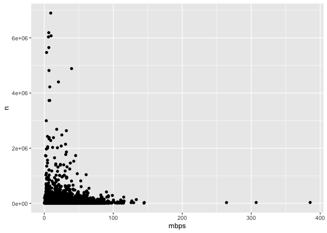
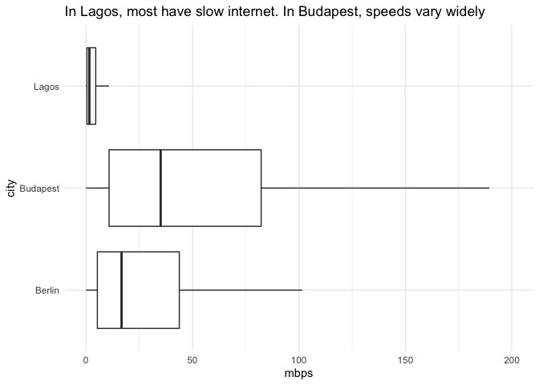

# Berlin, Lagos, Budapest: How fast is your internet?

Working from home is the new normal for millions of people worldwide.
Yet, data shows that 6 in 10 users do not have internet connections fast
enough for smooth telework. Has the pandemic deepened the digital
divide?

*In this repository, you will find the methodology, data and code behind
the story that came out of this analysis.*

**Read the full article on DW:** [English](https://www.dw.com/a-xxx) |
[German](https://www.dw.com/a-xxx)

**Story by:** [Kira Schacht](https://www.twitter.com/daten_drang) and
[Peter
Hille](https://twitter.com/peterhille)

# Files

| Name                   | Content                                                                           |
| ---------------------- | --------------------------------------------------------------------------------- |
| `broadband_cities.Rmd` | The main R markdown script. Run in RStudio to reproduce this analysis.            |
| `data.RData`           | The R Data file containing the imported datasets. Use if csv import doesn’t work. |
| `data/...`             | Data files                                                                        |

# Data sources

## Internet speed test data

This analysis uses data from [M-Lab](https://www.measurementlab.net/),
an open source project which collects and provides data on internet
speeds around the world. We use the results of their off-network
measurements (NDT tests). The data is crowdsources, updated continuously
and made freely available to the public. You can get more information
about their datasets as well as a guide on how to get started in working
with it yourself on their
\[website\](<https://www.measurementlab.net/data/>.

  - For data on median values per city, we used their
    [Dashboard](https://datastudio.google.com/reporting/12XddYj7__cZOaBF2RwplImw_ZdQQ5Nuw/page/9GTNB)
  - For a list of all measurements from Budapest, Berlin and Lagos,
    which we examine more closely, we used their BigQuery SQL interface.
    See query
    [here](https://console.cloud.google.com/bigquery?sq=754187384106:940cba401ad44bbf89eec11745789388)
  - We also used BigQuery to calculate how many total measurements since
    2019 have registered a download speed of at least 25 mbps. You can
    see that query
    [here](https://console.cloud.google.com/bigquery?sq=754187384106:a47c12beb9064ec0afde591ed0991892)

## Geodata

  - UN Statistics Division: [Standard country or area codes for
    statistical use
    (M49)](https://unstats.un.org/unsd/methodology/m49/): country codes
    and corresponding regions and continents
  - UN Department of Economic and Social Affairs: [The World’s Cities
    in 2018 Data
    Booklet](https://www.un.org/en/events/citiesday/assets/pdf/the_worlds_cities_in_2018_data_booklet.pdf):
    population of cities with at least 1 million inhabitants

# Analysis

Here is a step-by-step-explanation of the code we used in this analysis.
You can explore it yourself by opening `broadband_cities.Rmd` in
RStudio.

## 0\. Read data

For median values per city: Only include cities with at least 2500 data
points.

List of datasets used:

  - `d` Median speeds for cities since 2020-01-01, extracted from the
    dashboard. Only cities with \>= 2500 data points included. Merged
    with continent and region information, as well as population data
    for cities with more than 1 million inhabitants in 2018
  - `d_cities` All data points since 2019-01-01 for Berlin, Budapest and
    Lagos

<!-- -->
When cities have fewer than approx. 500,000 data points, download speeds
vary more.

## 1\. Median speed in cities of the world

### 1.1 Extract: Manual selection of interesting cities

File: `cities-median-selection.csv`

## 1.2 Top and flop list per continent

Only including cities with a population of \>= 1mn.

File: `cities-median-top-10.csv`

File: `cities-median-flop-10.csv`

<!-- -->

### 1.3 Speeds per continent by city and population

<!-- -->

## 2\. Internet speeds in selected cities

### 2.1 Extract: Internet speeds compared to guidelines

    ## `summarise()` ungrouping output (override with `.groups` argument)
    ## `summarise()` ungrouping output (override with `.groups` argument)

| activity                                                                               | mbps | Berlin | Budapest | Lagos |
| :------------------------------------------------------------------------------------- | ---: | -----: | -------: | ----: |
| Streaming Online Radio / VoIP Calls                                                    |  0.5 |   0.95 |     0.98 |  0.73 |
| General Browsing and Email / Social Media / Standard Personal Video Call (e.g., Skype) |  1.0 |   0.92 |     0.97 |  0.60 |
| HD Personal Video Call (e.g., Skype)                                                   |  1.5 |   0.89 |     0.96 |  0.51 |
| Game Console Connecting to the Internet                                                |  3.0 |   0.83 |     0.93 |  0.35 |
| Streaming Standard Definition Video / Online Multiplayer                               |  4.0 |   0.80 |     0.91 |  0.28 |
| HD Video Teleconferencing                                                              |  6.0 |   0.74 |     0.87 |  0.19 |
| Streaming High Definition (HD) Video                                                   |  8.0 |   0.69 |     0.84 |  0.14 |
| File Downloading                                                                       | 10.0 |   0.64 |     0.81 |  0.10 |
| Student / Telecommuting / Streaming Ultra HD 4K Video                                  | 25.0 |   0.42 |     0.67 |  0.02 |

File:
    `cities-guidelines-shares.csv`

### 2.2 Boxplot: Distribution of internet speeds in selected cities

    ## Warning: Removed 146825 rows containing non-finite values (stat_boxplot).

<!-- -->

    ## `summarise()` regrouping output by 'city' (override with `.groups` argument)

    ## Warning: Ignoring unknown parameters: lineend

    ## Warning: Removed 2 row(s) containing missing values (geom_path).
    
    ## Warning: Removed 2 row(s) containing missing values (geom_path).

<!-- -->

## 3\. Country-level comparison

### 3.1 Inclusive internet index

<!-- -->

